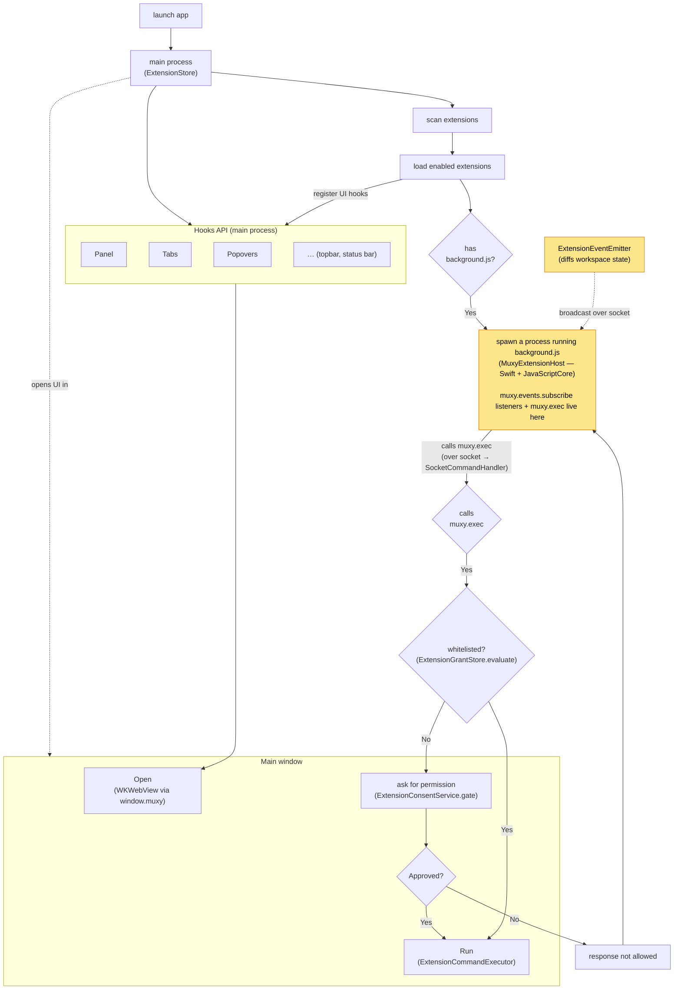

# Extensions

> **Status:** under active development. Marked **DEV** in **Settings → Extensions**. The manifest format, permission set, and wire format may change without notice.

User-installed directories that Muxy loads and runs. Extensions can react to workspace events, register palette commands, post notifications, and (with permission) drive the same verbs the `muxy` CLI exposes. Most need no background script; Muxy keeps a long-lived background process only for extensions that declare one to receive pushed events or run background shell commands.

## Architecture

On launch, the main process (`ExtensionStore`) scans `~/.config/muxy/extensions/`, loads the enabled ones, and splits each into two independent surfaces:

- **Hooks API (main process).** Declared UI — panels, tabs, popovers, topbar/status-bar items — is registered in-process and rendered in the main window as `WKWebView`s. Their JS talks to Muxy through the injected `window.muxy` bridge (`ExtensionBridgeHandler` → `MuxyAPIDispatcher`); **no subprocess and no socket are involved**.
- **Background script (subprocess).** If the extension declares a `background` script, `ExtensionStore.startExtension` spawns `MuxyExtensionHost` — a tiny bundled Swift + JavaScriptCore binary — to run `background.js`. It is where **`muxy.events.subscribe` listeners live** and where `muxy.exec` is called. The host connects back to the main process over the Unix socket (`NotificationSocketServer`).

Events are produced in the main process by `ExtensionEventEmitter` (it diffs workspace state on each change) and broadcast to subscribed host sessions over the socket; the host dispatches them to the `muxy.events` listeners in `background.js`. A `muxy.exec` call travels the socket to `SocketCommandHandler`, which gates it: `ExtensionGrantStore.evaluate` checks for a remembered (whitelisted) rule; if none, `ExtensionConsentService.gate` prompts in the main window; on approval `ExtensionCommandExecutor` runs the command and the result is returned to `background.js`.



> **Socket scope:** the Unix socket carries traffic between the main window and the **background.js** host (events out, `muxy.exec` in). The Hooks API UIs do **not** use the socket — they run in-process over the WebKit bridge.

## Pages

| Page | What's in it |
| --- | --- |
| [Overview](overview.md) | Architecture, lifecycle, security model |
| [Manifest](manifest.md) | `manifest.json` fields, validation, background script environment |
| [Permissions](permissions.md) | What each permission grants, what isn't gated |
| [Events](events.md) | Identify/subscribe handshake, event list, wire format |
| [Palette Commands](palette-commands.md) | Register commands and react to triggers |
| [Tabs](tabs.md) | Register webview tab types and the injected `window.muxy` JS API |
| [Panels](panels.md) | Register dockable/floating webview panels and the placement rules |
| [Popovers](popovers.md) | Anchor a transient webview popover to a topbar/status bar item |
| [Topbar](topbar.md) | Attach icons to the tab strip that trigger a command |
| [Status Bar](statusbar.md) | Attach icons to the footer status bar; update text live |
| [Settings](settings.md) | Declare typed settings and read/write them at runtime |
| [Scripts](scripts.md) | Run JS files as palette commands in a per-extension JSContext |
| [Logs](logs.md) | Where logs live on disk, console.* bridge, size cap and trim policy |
| [Contributing](contributing.md) | Create, validate, and publish an extension |

## Quick links

- Example extension: [`examples/hello-world`](examples/hello-world)
- Manifest schema: [`schema/manifest.schema.json`](schema/manifest.schema.json)
- Community extensions: [muxy-extensions repo](https://github.com/muxy-app/extensions)

## Quick reference

- Install path: `~/.config/muxy/extensions/<name>/`
- Background script: optional `background.js`, run in a host process that injects the `muxy` global
- Background API: `muxy.extensionID`, `muxy.events.subscribe`, `muxy.exec`, `console.*`
- See [the muxy CLI feature page](../features/muxy-cli.md) for the verb vocabulary

## Minimal example

Most extensions need no background script. A manifest alone registers commands, topbar/status bar items, tabs, and `runScript` handlers, and Muxy keeps no resident process for it:

```
~/.config/muxy/extensions/hello/
  manifest.json
```

```json
{
  "name": "hello",
  "version": "0.1.0",
  "permissions": ["notifications:write"],
  "commands": [
    { "id": "ping", "title": "Hello: Ping" }
  ]
}
```

## Example with a background script

Add a `background` script **only** to receive pushed events or run background shell commands. Muxy then runs it in a long-lived host process that stays alive for the lifetime of the extension:

```
~/.config/muxy/extensions/hello/
  manifest.json
  background.js
```

```json
{
  "name": "hello",
  "version": "0.1.0",
  "background": "background.js",
  "permissions": ["commands:exec"],
  "events": ["pane.created"],
  "commands": [
    { "id": "ping", "title": "Hello: Ping" }
  ]
}
```

```js
// background.js
muxy.events.subscribe('pane.created', async (payload) => {
  const result = await muxy.exec(['git', 'status', '--short']);
  console.log(result.stdout);
});
```
